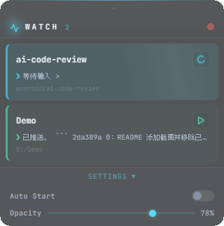

# ClaudeWatch

**[English](#english)** | **[中文](#中文)**

---

<p align="center">
  
</p>

---

<span id="english"></span>

A lightweight floating desktop widget that monitors your [Claude Code](https://claude.ai/code) sessions in real time on Windows.


## Features

- **Live Session Monitoring** - Automatically detects active Claude Code CLI sessions and displays their status (idle, thinking, working)
- **Always on Top** - Floats above all windows as a compact overlay
- **Draggable** - Grab the grip bar to reposition anywhere on screen
- **Opacity Control** - Adjust window transparency from 20% to 100% via a slider
- **Auto-start on Boot** - Optional startup with Windows via registry entry
- **Rounded Corners** - Native Win32 region clipping for smooth rounded edges
- **Dark Theme** - Cyberpunk-inspired UI with JetBrains Mono font and glow effects

## Preview

The widget displays each Claude Code session as a card with:

| Status    | Color  | Indicator         |
|-----------|--------|--------------------|
| Idle      | Green  | Static play icon   |
| Thinking  | Amber  | Pulsing lightbulb  |
| Working   | Cyan   | Spinning loader    |

A scan-line animation plays across cards in the working state.

## Getting Started

### Prerequisites

- Python 3.8+
- Windows 10/11
- [pywebview](https://pywebview.flowrl.com/) with EdgeChromium backend

### Install

```bash
pip install pywebview
```

### Run

```bash
python widget.py
```

## Settings

Click **SETTINGS** at the bottom to expand the settings panel:

### Auto-start on Boot

Toggle the switch to register/unregister ClaudeWatch in the Windows startup registry:

```
HKEY_CURRENT_USER\Software\Microsoft\Windows\CurrentVersion\Run
```

### Opacity

Drag the slider to adjust window transparency. Uses Win32 `SetLayeredWindowAttributes` API for smooth, flicker-free transparency without the white-background artifacts common with CSS-only approaches.

Range: **20%** (nearly invisible) to **100%** (fully opaque)

## How It Works

```
widget.py (pywebview host)
  └── StatusMonitor (background thread, polls every 2s)
        └── Reads ~/.claude/projects/**/*.jsonl
              └── Pushes session status to UI via evaluate_js()
                    └── widget.html renders task cards
```

1. **StatusMonitor** scans `~/.claude/projects/` for recently modified `.jsonl` session files
2. Parses the last 60 lines of each session to extract tool usage and text output
3. Determines session status based on file modification time (< 10s = working, < 45s = thinking, else idle)
4. Pushes updates to the HTML frontend via `window.updateTasks()`
5. The UI auto-resizes the window to fit content using `pywebview.api.resize()`

## Project Structure

```
ClaudeWatch/
├── widget.py                  # pywebview host + session monitor
├── widget.html                # UI (HTML/CSS/JS in single file)
├── claude_monitor.py          # Alternative monitor implementation
├── claude_status_widget.html  # Standalone demo page
├── ClaudeMonitor.spec         # PyInstaller build spec
└── README.md
```

## Building

```bash
pip install pyinstaller
pyinstaller ClaudeMonitor.spec
```

## License

MIT

---
---

<span id="中文"></span>

一个轻量级的 Windows 桌面悬浮窗小组件，实时监控你的 [Claude Code](https://claude.ai/code) 会话状态。


## 功能特性

- **实时会话监控** - 自动检测活跃的 Claude Code CLI 会话，显示其状态（空闲、思考、工作中）
- **窗口置顶** - 始终悬浮在所有窗口之上
- **可拖拽** - 拖动顶部手柄栏自由移动位置
- **透明度调节** - 通过滑块调节窗口透明度（20% ~ 100%）
- **开机自启** - 可选开机自动启动，通过注册表实现
- **圆角窗口** - Win32 原生区域裁剪实现平滑圆角
- **暗色主题** - 赛博朋克风格 UI，JetBrains Mono 字体 + 辉光特效

## 预览

Widget 以卡片形式展示每个 Claude Code 会话：

| 状态   | 颜色 | 指示器         |
|--------|------|----------------|
| 空闲   | 绿色 | 静态播放图标   |
| 思考   | 琥珀 | 脉冲灯泡图标   |
| 工作中 | 青色 | 旋转加载图标   |

工作状态下的卡片会显示扫描线动画。

## 快速开始

### 环境要求

- Python 3.8+
- Windows 10/11
- [pywebview](https://pywebview.flowrl.com/) EdgeChromium 后端

### 安装

```bash
pip install pywebview
```

### 运行

```bash
python widget.py
```

## 设置

点击底部的 **SETTINGS** 展开设置面板：

### 开机自启

拨动开关即可在 Windows 启动注册表中注册/取消 ClaudeWatch：

```
HKEY_CURRENT_USER\Software\Microsoft\Windows\CurrentVersion\Run
```

### 透明度

拖动滑块调节窗口透明度。采用 Win32 `SetLayeredWindowAttributes` API 实现流畅无闪烁的透明效果，避免了纯 CSS 方案常见的白色底色问题。

范围：**20%**（近乎透明）到 **100%**（完全不透明）

## 工作原理

```
widget.py (pywebview 宿主)
  └── StatusMonitor (后台线程，每 2 秒轮询)
        └── 读取 ~/.claude/projects/**/*.jsonl
              └── 通过 evaluate_js() 推送会话状态到 UI
                    └── widget.html 渲染任务卡片
```

1. **StatusMonitor** 扫描 `~/.claude/projects/` 中最近修改的 `.jsonl` 会话文件
2. 解析每个会话最后 60 行，提取工具调用和文本输出
3. 根据文件修改时间判断状态（< 10 秒 = 工作中，< 45 秒 = 思考，否则空闲）
4. 通过 `window.updateTasks()` 推送更新到前端
5. UI 通过 `pywebview.api.resize()` 自动调整窗口大小

## 项目结构

```
ClaudeWatch/
├── widget.py                  # pywebview 宿主 + 会话监控器
├── widget.html                # 界面（HTML/CSS/JS 单文件）
├── claude_monitor.py          # 备选监控实现
├── claude_status_widget.html  # 独立演示页面
├── ClaudeMonitor.spec         # PyInstaller 构建配置
└── README.md
```

## 构建

```bash
pip install pyinstaller
pyinstaller ClaudeMonitor.spec
```

## 许可证

MIT
